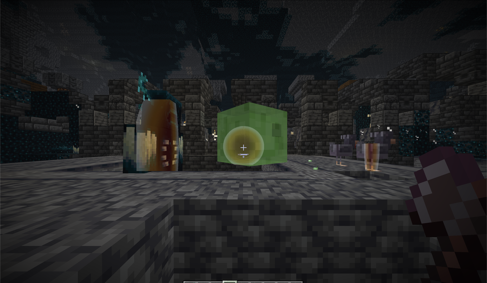
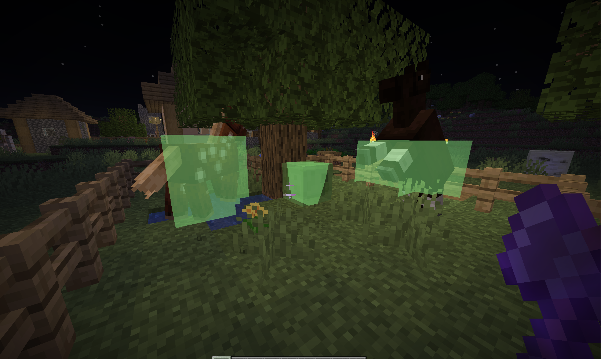
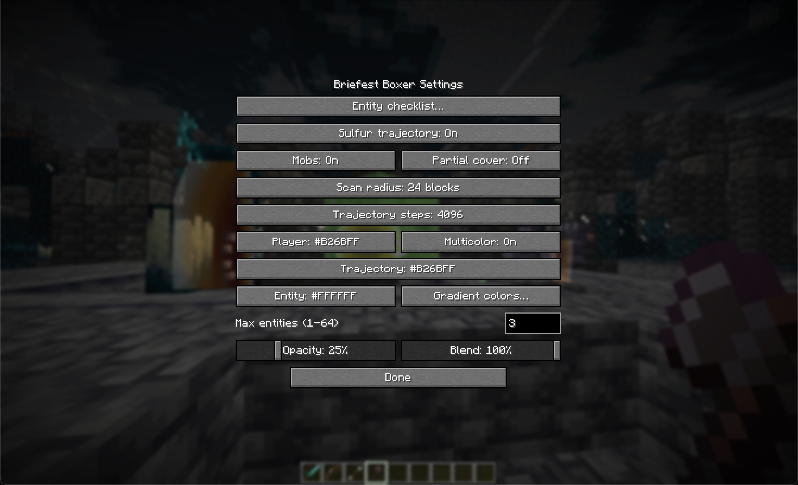
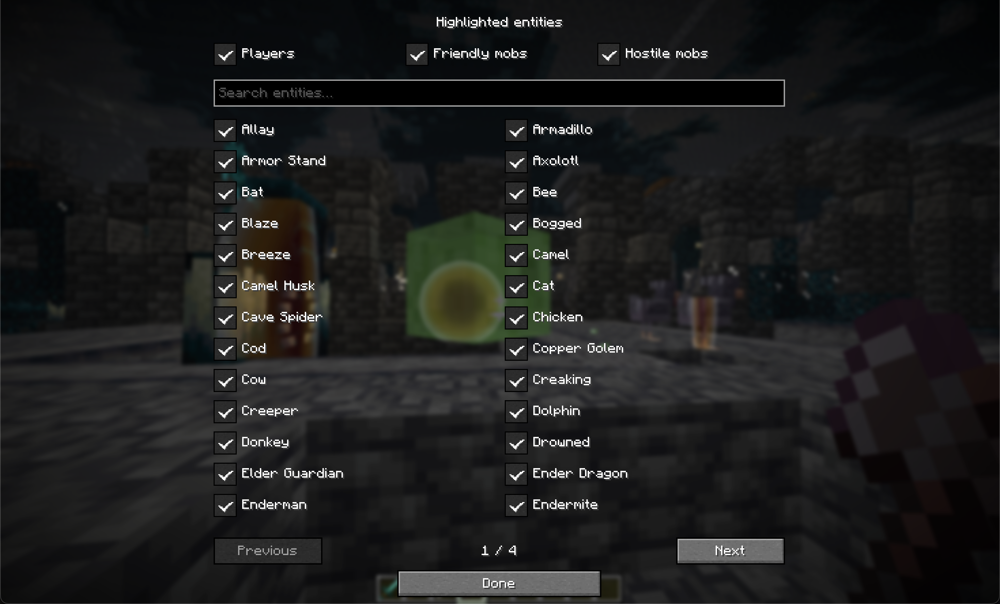
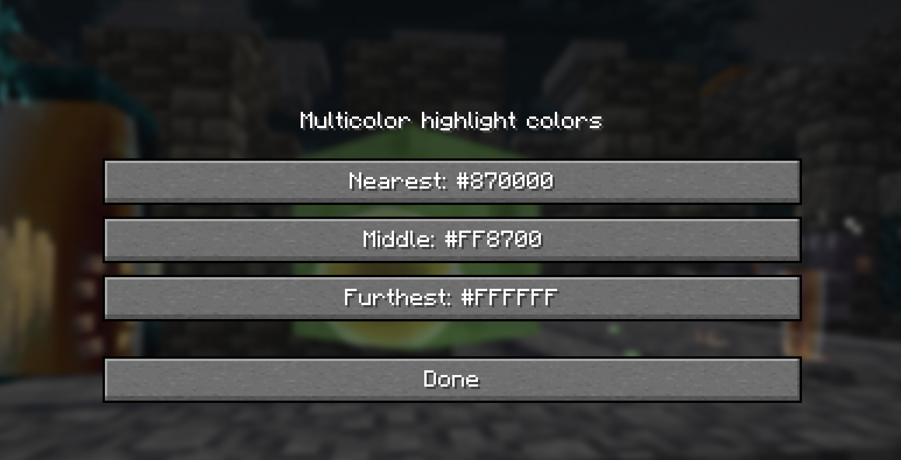
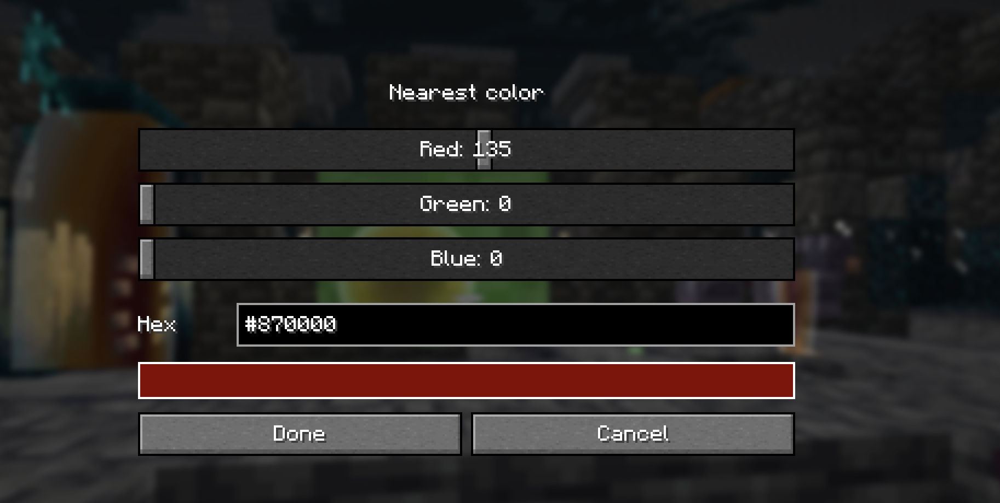

# Briefest Boxer

Highlights the reachable portions of entity hitboxes, with configurable colors and opacity.

Enable **Multicolor** in the 26.2 Mod Menu settings for red (nearest), yellow, and green (furthest) reachable surfaces, normalized separately for each entity. **Gradient colors…** provides separate Nearest, Middle, and Furthest color pickers (red/yellow/green by default). All six color settings accept any `#RRGGBB` value through RGB sliders and a hex input, with a color preview. The **Blend** slider controls transition smoothness (0% for distinct bands, 100% for broad smooth transitions). The option defaults to off; other versions can enable `multicolorHighlights=true` in `config/briefest_boxer.properties`, with `multicolorSmoothness=0`–`100` (default `100`).

The 26.2 **Entity checklist…** offers searchable entity-type checkboxes and Players, Friendly mobs, and Hostile mobs group toggles. Friendly includes passive/neutral animals; hostile uses Minecraft’s monster category. Group toggles select or clear the group, and individual choices are saved. Dropped items remain excluded.

**Partial cover** (off by default) shows the entire reachable highlight on a partly visible entity, including portions behind blocks. Fully hidden entities remain excluded.

## In-game highlights

### Multicolor reachable surfaces

## Settings (26.2 Fabric)

### Highlight controls

### Entity checklist

### Gradient colors

### RGB color picker

## License

Licensed under [GNU LGPL 3.0](LICENSE) (`LGPL-3.0-only`). The incorporated GNU GPL 3.0 terms are included in [COPYING](COPYING).
